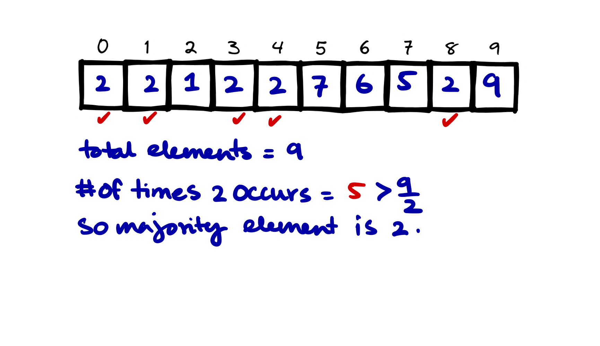
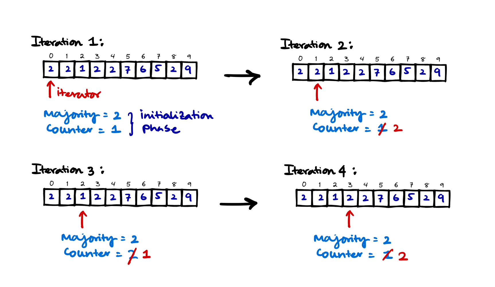
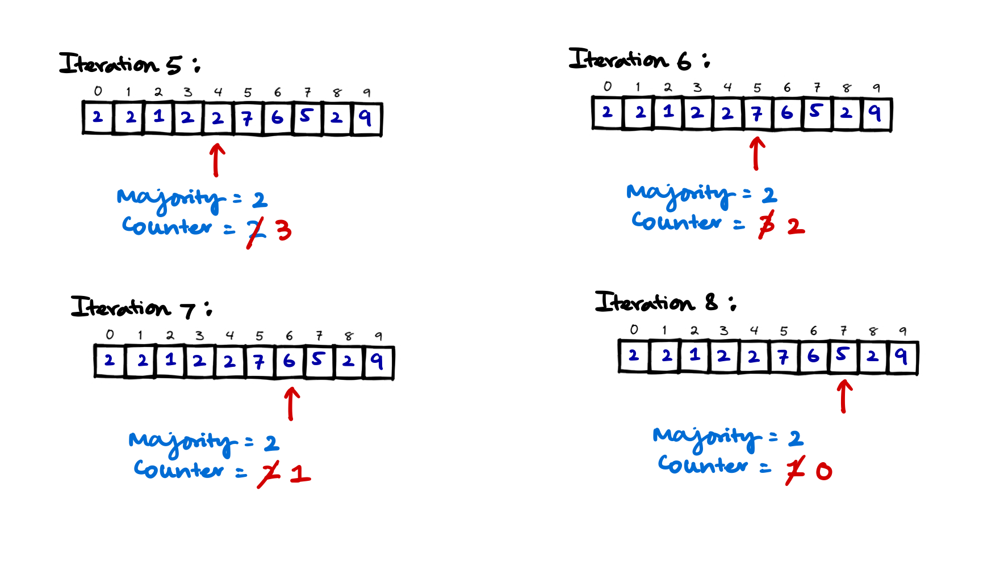
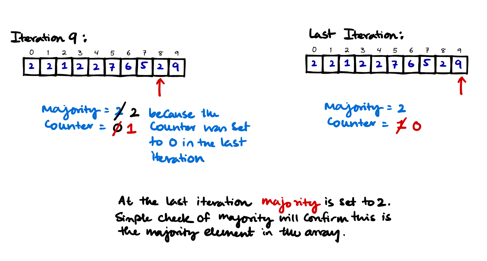
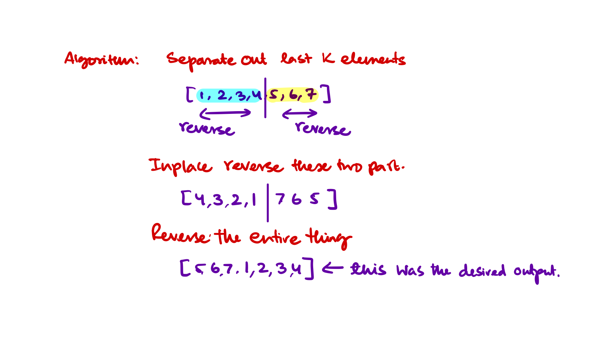

# Problems on arrays
## Single Number
[Problem on Leetcode $\to$](https://leetcode.com/problems/single-number/)
### Problem Statement
Given a non-empty array of integers nums, every element appears twice except for one. Find that single one. You must implement a solution with a linear runtime complexity and use only constant extra space.

### Approach
If the problem was given in a sorted array we can implement this [binary search approach](https://algorithms.theroyakash.com/binary-search/problems/#single-element-in-a-sorted-array). But here the array is not sorted. We can use a dictionary but it'll take more space.

Only other way of solving this problem is to use XOR operations. For each element in the array if we XOR them with each other we can find the odd one out.

### Code
```cpp
class Solution {
public:
    int singleNumber(vector<int>& nums) {
        int start = nums.front();
        for (int i=1; i<nums.size(); i++) {
            start ^= nums[i];
        }
        
        return start;
    }
};
```

## Dutch National Flag Partitioning

### Problem Statement
Implemented naively, quicksort has large run times and deep function call stacks on arrays with many duplicates because the subarrays may differ greatly in size. One solution is to reorder the array so that all elements less than the pivot appear first, followed by elements equal to the pivot, followed by elements greater than the pivot. This is known as Dutch national flag partitioning, because the Dutch national flag consists of three horizontal bands, each in a different color.

### Solution Pattern
- Main thing to do in this problem is to make groups of elements whose values are less, equal, more than the target.
- For $O(N)$ space solutions we can create three new arrays called `less, more, equal` and put values into it during the traversal.
- For $O(1)$ space solutions we can do these steps:
    - Do - inplace grouping of all the less than target elements during the first pass,
    - Do - inplace grouping of all the greater than target elements during the next pass. During this pass if we find one element that is greater than the target we can say that "Hey! we have entered into the `less` subarray", so we can break out of the loop.
    - Total time complexity is $O(N)$ for the first pass and on an avarage $O(\frac{N}{2})$ in the second pass. Total of $O(N)$.


```python
def dutch_flag_partition(pivot_index: int, A: list[int]) -> None:
    pivot_value: int = A[pivot_index]

    small: int = 0

    # Group all the smaller elements together at the start
    # This is in-place grouping of elements smaller than some target
    for i in range(len(A)):
        if A[i] < pivot_value:
            A[small], A[i] = A[i], A[small]
            small += 1

    # Group all the larger elements together at the end
    larger: int = len(A) - 1
    for i in reversed(range(len(A))):
        if A[i] < pivot_value:
            break
        elif A[i] > pivot_value:
            A[i], A[larger] = A[larger], A[i]
            larger -= 1
```

!!! note "Test Cases"
    - Test PASSED (204/204) [   8 ms]
    - Avarage running time:   65 us
    - Median running time:    13 us


!!! note "Similar problems"
    Given an array of n objects with keys that takes on of four values, reorder the array so that all the objects that have the same values appear together. $O(1)$ space and $O(N)$ time.


## String Compression Problem

### Problem Statement
Implement a method to perform basic string compression, like "aaaabbbcccaa" $\to$ "a4b3c3a2"

### Approach
- Make a one key dictionary. Add and count the subsequent characters, for C++ you'd make a `pair<int, int>` and destroy it once a new character is seen,
- Once you find a new element then drop the key, add the contents to the builder string and count again.

### Code
```python
def string_compressing(string: str) -> str:
    build_string: list[str] = []  # using character array instead of string for O(1) append
    dictionary: dict[str, int] = {}

    for character in string:
        if character in dictionary:
            dictionary[character] += 1
        elif character not in dictionary:
            if dictionary != {}:
                # If the dictionary is not empty means we have a new element to consider.
                # Dump the contents to the build_string and make the dictionary = {}
                build_string.append(list(dictionary.keys())[0])
                build_string.append(str(dictionary[list(dictionary.keys())[0]]))
            
            dictionary = {}
            # Set the new character count to 1
            dictionary[character] = 1

    build_string.append(list(dictionary.keys())[0])
    build_string.append(str(dictionary[list(dictionary.keys())[0]]))
    
    build_string = "".join(build_string)  # This does not take O(N^2), takes only O(N) to concatenate a character array to a string.
    build_string = build_string.replace("1", '')  # O(N)
    return build_string
```


```python
string_compressing("abbbcccaa")  # -> 'ab3c3a2'
```

### Time complexity
This solution take $O(N)$ time and constant space if you don't count the return string. It uses space to hold an **one key** dictionary and the return string.

## Best Time to Buy and Sell Stock
[Problem on Leetcode $\to$](https://leetcode.com/problems/best-time-to-buy-and-sell-stock/)

### Problem Statement
You are given an array prices where `prices[i]` is the price of a given stock on the $\text{i}^{\text{th}}$ day.

You want to maximize your profit by choosing a single day to buy one stock and choosing a different day in the future to sell that stock.

Return the maximum profit you can achieve from this transaction. If you cannot achieve any profit, return $0$.

### Examples
#### Example 1
```
Input: prices = [7,1,5,3,6,4]
Output: 5
Explanation: Buy on day 2 (price = 1) and sell on day 5 (price = 6), profit = 6-1 = 5.
Note that buying on day 2 and selling on day 1 is not allowed because you must buy before you sell.
```
#### Example 2
```
Input: prices = [7,6,4,3,1]
Output: 0
Explanation: In this case, no transactions are done and the max profit = 0.
```

### Approach
- We start with the lowest profit possible which is $0$,
- We'll start the analysis from day $1$ not from day $0$,
- We indicate the dip is the day $0^{th}$ price. If we buy at that price then we analyse further.
- Now we analyze from day $1 ... N$
    - For day $1$ if we sell that stock the profit will be `profSLT = prices[1] - dip` at the **lowest dip so far**, we update the max profit by taking the `std::max` of previous maximum profit and todays profit.
    - If todays price is lower than the last day's price, it is possible that we can get a better solution (profit) if not we already have stored the last best profit.
    - We repeat this until we reach the last day.

### Code
```cpp
class Solution {
public:
    int maxProfit(vector<int>& prices) {
        int mprof = 0; // maximum profit
        int dip = prices[0]; // should buy at lowest dip starting from day 1
        
        for (int i=1; i<prices.size(); i++) {
            // profit if sold today bought at the lowest dip so far;
            int profSLT = prices[i] - dip;
            // if this is the maxprofit then update
            mprof = std::max(mprof, profSLT);
            
            if (prices[i] < dip) dip = prices[i];
        }
        
        return mprof;
    }
};
```
## Best Time to Buy and Sell Stock II
[Problem on Leetcode $\to$](https://leetcode.com/problems/best-time-to-buy-and-sell-stock-ii/)
### Problem Statement
Similar to the previous problem, you are given an integer array prices where `prices[i]` is the price of a given stock on the ith day.

On each day, you may decide to buy and/or sell the stock. You can only hold at most one share of the stock at any time. However, you can buy it then immediately sell it on the same day.

Find and return the maximum profit you can achieve.
### Approach
Similar to the previous problem we'll continue to implement the logic but, if we see a dip later in the future, we'll sell off and buy at tomorrows dip to avoid any potential loss.

!!! note
    Here `profitInCurrentWindow` in the code denotes the profit in the current window. An window is reset when we sell off the stock because there will be a dip in the next day. We start the window by buying the stock in the next dip.

### Code
```cpp
class Solution {
public:
    int maxProfit(vector<int>& prices) {
        
        if (prices.size() == 1) return 0;
        
        int totalProfit = 0;
        int dip = prices[0];
        int profitInCurrentWindow = 0;
        
        // start from day 1 and local dip so far is day 0's price
        for (int index = 1; index < prices.size(); index++) {
            // today's price = prices[index]
            int price = prices[index];
            // see if selling today entails profit?
            int profit = price - dip;
            
            // what is the max profit possible in the current window
            profitInCurrentWindow = std::max(profitInCurrentWindow, profit);
            
            // if it is profitable and tomorrow's price goes down don't hold, sell and exit
            // and reset the problem to next day and start again
            if (profit > 0 and index < prices.size() - 1) {
                if (prices[index + 1] < prices[index]) {
                    totalProfit = totalProfit + profitInCurrentWindow;
                    // also reset the dip to the index + 1
                    // for a new profit calculation for tomorrow
                    dip = prices[index + 1];
                    index++; // we reset the entire problem and recalculate everything from the next index
                    profitInCurrentWindow = 0; // reset the profit in the window
                }
            }
            
            if (price < dip) dip = price;
        }
        
        totalProfit += profitInCurrentWindow; // update the last profit window
        
        return totalProfit;
    }
};
```
## Insert Interval
[Same Problem on Leetcode $\to$](https://leetcode.com/problems/insert-interval/)
### Problem Statement
You are given an array of non-overlapping intervals intervals where $\text{intervals}[i] = [\text{start}_i, \text{end}_i]$ represent the start and the end of the ith interval and intervals is sorted in ascending order by starti. You are also given an interval $\text{newInterval} = [\text{start}, \text{end}]$ that represents the start and end of another interval.

Insert newInterval into intervals such that intervals is still sorted in ascending order by starti and intervals still does not have any overlapping intervals (merge overlapping intervals if necessary).

Return intervals after the insertion.

### Examples
```
Input: intervals = [[1,3],[6,9]], newInterval = [2,5]
Output: [[1,5],[6,9]]

Input: intervals = [[1,2],[3,5],[6,7],[8,10],[12,16]], newInterval = [4,8]
Output: [[1,2],[3,10],[12,16]]
Explanation: Because the new interval [4,8] overlaps with [3,5],[6,7],[8,10].
```

## Missing Number
[Find the problem on Leetcode $\to$](https://leetcode.com/problems/missing-number/)

### Problem statement
Given an array nums containing n distinct numbers in the range [0, n], return the only number in the range that is missing from the array.

### Example
```
Input: nums = [3,0,1]
Output: 2
Explanation: n = 3 since there are 3 numbers, so all numbers are in the range [0,3]. 
2 is the missing number in the range since it does not appear in nums.
```

### Approach
- There can be several approaches, one of which is sorting then find what's missing?
- There is also another approach where you sum up all the numbers (using $\frac{n(n+1)}{2}$) then subtract from elements present in the array. This is a $O(N)$ and constant space solution. But using this is risky because if $n$ is anywhere large enough to $\text{INT_MAX}$ then there is a high probability that $\frac{n(n+1)}{2}$ overflows. So it is not recommended to use this approach instead use the following one:
- There is another approach where you use XOR operations to find the missing elements. I have written all the code for all the approaches below. Here is no chance of integer overflow or anything. For XOR apporach you first have to find the XOR of elements from $\{1 \to n\}$ then find the XOR of elements present in the array. Now XOR between these two is the missing element so return it.

### Code
#### Using sorting method
```cpp
class Solution {
public:
    int missingNumber(vector<int>& nums) {
        std::sort(nums.begin(), nums.end());
        
        int index = 0;
        for (auto i:nums) {
            if (i != index) return index;
            index++;
        }
        
        return index;
    }
};
```

#### Using sum and substraction method
```cpp
class Solution {
public:
    int missingNumber(vector<int>& nums) {
        int n = nums.size();
        int sum = n*(n+1) / 2;
        
        for (int i:nums) sum -= i;
        
        return sum;
    }
};
```

#### Using XOR Method
```cpp
class Solution {
public:
    int missingNumber(vector<int>& nums) {
        int l1 = 0; // contains xor of 1 to n
        int l2 = nums[0]; // contains xor of all the nums elements
        
        
        for (int i=0; i <= nums.size(); i++) {
            l1 ^= i;
        }
        
        for (int j=1; j<nums.size(); j++) {
            l2 ^= nums[j];
        }
        
        return l1^l2;
    }
};
```

## Majority Element
[Problem on Leetcode $\to$](https://leetcode.com/problems/majority-element/)
### Problem Statement
Given an array nums of size n, return the majority element.

The majority element is the element that appears more than $\lfloor\frac{n}{2}\rfloor$ times. You may assume that the majority element always exists in the array.

### Approach
- One approach is to use a dictionary to implement a counter for each element. Then find what is $\gt \lfloor\frac{n}{2}\rfloor$, but it'll take extra $O(n)$ space. So we need to find a new approach.
- There is an algorithm called boyer moore majority voting algorithm, using that we can easily find the majority element in the array.

### Boyer Moore Algorithm
Boyer–Moore majority vote algorithm can find the majority of a sequence of elements using linear time and constant space if exists. The returned result may not be the majority element (if not exists), so we have to do an additional check if the indicated element indeed the majority element.

The algorithm goes like this:
- Initialize an element majority and a counter `counter` with `counter = 0`
- For each element x of the input sequence:
    - If `counter = 0`, then assign majority as x and `counter = 1`
    - If you encounter next the same element as the majority element you increment the counter.
    - Otherwise decrease the counter and no change to the majority element.
- at the end return the `majority` variable. It may be or may not be the majority element (if it doesn't exists) then we need check if that is the majority element with just a single pass.

### Example
Let's run the algorithm on an example to see how this is working


### Running the algorithm on the example
#### Iteration 1 to 4

#### Iteration 5 to 8

#### Iteration 9 and 10


At the very end the majority variable may or may not contains the majority element. We need check if that is the majority element with  a single pass on the array to count up the number of occurrences of the element indicated in majority variable.

### Code
```cpp
class Solution {
public:
    int majorityElement(vector<int>& nums) {
        int counter = 0;
        int majority = 0;
        
        for (int i:nums) {
            if (counter == 0) {
                majority = i;
                counter += 1;
            } else {
                if (i == majority) {
                    counter++;
                } else {
                    counter--;
                }
            }
        }
        
        return majority; // we assume that the majority element always exists in the array
    }
};
```

## Rotate Array
[Problem on Leetcode $\to$](https://leetcode.com/problems/rotate-array/)
### Problem Statement
Given an array, rotate the array to the right by k steps, where k is non-negative in constant space and linear time.
### Examples
```
Input: nums = [1,2,3,4,5,6,7], k = 3
Output: [5,6,7,1,2,3,4]
Explanation:
rotate 1 steps to the right: [7,1,2,3,4,5,6]
rotate 2 steps to the right: [6,7,1,2,3,4,5]
rotate 3 steps to the right: [5,6,7,1,2,3,4]
```

```
Input: nums = [-1,-100,3,99], k = 2
Output: [3,99,-1,-100]
Explanation: 
rotate 1 steps to the right: [99,-1,-100,3]
rotate 2 steps to the right: [3,99,-1,-100]
```
### Several approaches with C++ code
Not so much of an optimized approach, will fetch you a TLE. But for understanding it is a great apporach. We convert the `k` rotation problem into a subproblem of `rotationOnce()` for k times. We implement the `rotationOnce()` subroutine like this:

- See the last element, store it in `last` variable.
- then for element of index starting from $\text{last} - 2$ down to $0$ swap it with the next element, to shift it by one,
- at last swap the first element ($0^{th}$ index element with the `last` variable).
- This is how you rotate by one element.
- Do this K times to solve the problem. Total time complexity is $O(kn)$, so we'll get TLE in the compiler. This is a polynomial in $n$ and $k$. But $k$ can be $2^n$ so overall this is not efficient. We can reduce the number of subroutine calls down to $k \text{mod} n$ but if $n$ is large enough and $k$ is almost $n$ then the problem of TLE again occurs.

**Here is a code using this approach**
```cpp
class Solution {
private:
    void rotateOnce(vector<int>& nums) {
        int last = nums.back();
        int size = nums.size();
        
        for (int i=size-2; i>=0; i--) {
            nums[i+1] = nums[i];
        }
        
        nums[0] = last;
    }
public:
    void rotate(vector<int>& nums, int k) {
        int rotations = k % nums.size();
        while(rotations) {
            rotateOnce(nums);
            rotations--;
        }
    }
};
```

The code here will not run in a reasonable amount of time for a sufficiently large input size. So we have to design some better algorithms.

#### Using Extra space (a faster algorithm in linear time)
Instead of using the rotate once subroutine we can store all the last k elements in some temporary array, then instead of shifting one element once to the right and putting the last element to the front we can

- push those elements k step ahead
- put last k elements to the front of the array.

This way the time complexity becomes linear time in $O(n + k)$. This does not give TLE. But this takes $O(k)$ extra space.

```cpp
class Solution {
public:
    void rotate(vector<int>& nums, int k) {
        k = k % nums.size();
        int size = nums.size();
        
        vector<int> temp(nums.end()-k, nums.end());
        
        // for all the elements starting from
        // size - k - 1 down to 0 write it k space ahead
        
        for (int i=size-k-1; i>=0; i--) {
            nums[i + k] = nums[i];
        }
        
        int start = 0;
        for (auto t:temp) {
            nums[start] = t;
            start++;
        }
    }
};
```

#### Without extra space and linear time complexity in $n$
There is a very ingenious solution to the problem. I'll explain this with diagrams and will give you an working C++ code.
##### Approach
The approach to get the solution goes like this:

- inplace reverse the array from last to $k$,
- then inplace reverse the array from start to `size - k`
- now reverse the whole array.

##### Dry run on some example
**Example array**

**Dry run on that example**


##### Code
```cpp
class Solution {
private:
    void inplace_reverse(vector<int>& nums, int start, int end) {
        while (start < end) {
            int temp = nums[start];
            nums[start] = nums[end];
            nums[end] = temp;
            start++;
            end--;
        }
    }
public:
    void rotate(vector<int>& nums, int k) {
        k = k % nums.size();
        int size = nums.size();
        
        inplace_reverse(nums, size-k, size-1);
        inplace_reverse(nums, 0, size-k-1);
        inplace_reverse(nums, 0, size-1);
    }
};
```

## How Many Numbers Are Smaller Than the Current Number
[Problem on Leetcode $\to$](https://leetcode.com/problems/how-many-numbers-are-smaller-than-the-current-number/)
### Problem Statement
Given the array nums, for each `nums[i]` find out how many numbers in the array are smaller than it. That is, for each `nums[i]` you have to count the number of valid `j`'s such that `j != i` and `nums[j] < nums[i]`.

Return the answer in an array.

### Approach
The most straight forward approach is to implement this by sorting and binary searching the lower bound for each element in the array. First we sort the array. The amount of element that is lower than each element in the array is actually equal to the lowerbound on the sorted array.

Using a non comparison based sorting algorithm we can reduce the time complexity even further down to $O(n)$.
### Code
```cpp
class Solution {
private:
    int lower_bound(vector<int> &nums, int target) {
        int start = 0;
        int end = nums.size() - 1;
        
        int middle = start + (end - start) / 2;
        
        while (start < end) {
            if (nums[middle] == target) end = middle;
            if (nums[middle] < target) start = middle + 1;
            if (nums[middle] > target) end = middle - 1;
            
            middle = start + (end - start) / 2;
        }
        
        return start;
    }
public:
    vector<int> smallerNumbersThanCurrent(vector<int>& nums) {
        vector<int> v(nums.begin(), nums.end());
        vector<int> answers;
        sort(v.begin(), v.end());
        
        for (int i:nums) {
            int lb = lower_bound(v, i);
            answers.push_back(lb);
        }
        
        return answers;
    }
};
```