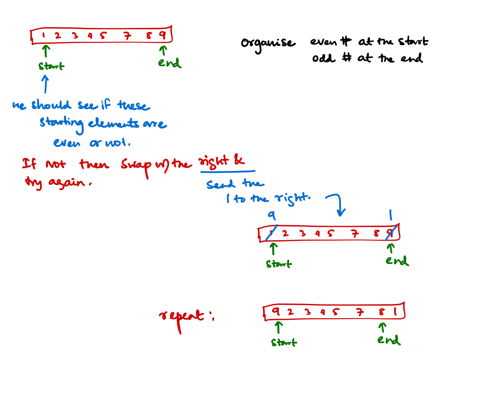

# Arrays

Most of the array problems are typically solved with trivial solutions if $O(N)$ space is given. Not so much when we can not use extra space, but we can still implement the solution without any additional space using some `[x:y:z]` slice of the array.

## Example problem

### Problem Statement
```{admonition} Problem
Your input is an array of integers, and you have to reorder its entries so that the even entries appear first.
```

### Solution

We can solve the problem with $O(N)$ space trivially. But to solve the problem with constant space we have to reuse space inside the given array.



#### Algorithm
- Start with both the end. If you find an element odd at the beginning, swap the element with the last element regardless of the status of the last element. Because if you put the first odd element that you see at the end means that odds are at the end. Now your query space reduces from $0 \to (N-1)$ to $0 \to (N-2)$
- If you find an element "even" at the beginning just skip it because it means that even elements are at the beginning. Now your query space reduces from $0 \to(N-1)$ to $1 \to (N-1)$
- Repeat until pointers pointing start of the array crosses pointers pointing end of the array.

#### Python Code [Python 3.9 and above]

```python
def even_odd_separation(array: list[int]):
    start: int, end: int = 0, len(array) - 1
    
    # Don't stop until start crosses end
    while start < end:
        if array[start] % 2 == 0:
            # The number at the start is even, so reduce the space to 1 ... n - 1
            start += 1
        else:
            # Number infront of the array is odd
            array[start], array[end] = array[end], array[start]
            end -= 1
```

### Time and space complexity
The above program changes the array in place, so constant space and passes through the array only once, so time complexity is $O(N)$.

```{admonition} Test cases
Test PASSED (1001/1001) [ 7 ms]
Average running time:   22 us
Median running time:     7 us
```

## Things to remember before solving Array Questions
- Array problems often have simple brute.force solutions that use $O(n)$ space, but there are subtler solutions that use the array itself to reduce space complexity to $O(1)$,
- Filling an array from the front is slow, so see if it's possible to write values from the back, with `append()` method,
- Instead of deleting an entry from the array try to relocate or MARK as deleted the element. Because deleting element from array is worst case $O(N)$, beacuse all the elements to the right have to swapped one step left,
- `A.reverse()` is inplace reversal of array,
- `reversed(A)` returns an iterator,
- `del A[i]` removes the i th element,
- `A[::-1]` reverses the array,
- Try using more of the list comprehension methods.

## One toy problem

```{admonition} Problem statement
Given an array nums containing n distinct numbers in the range [0, n], return the only number in the range that is missing from the array.
```

### Examples

```
Input: nums = [3,0,1]
Output: 2
Explanation: n = 3 since there are 3 numbers, so all numbers are in the range [0,3]. 2 is the missing number in the range since it does not appear in nums.

Input: nums = [0,1]
Output: 2
Explanation: n = 2 since there are 2 numbers, so all numbers are in the range [0,2]. 2 is the missing number in the range since it does not appear in nums.
```

### Solution
#### Approach
Find the possible sum if all the elements are present. Now find what is the actual sum in $O(N)$ time. Subtract from each other to get the absent element.

#### Code
```python
def missingNumber(self, nums: List[int]) -> int:

    max_number: int = len(nums)
    possible_sum: int = (max_number * (max_number + 1)) / 2

    actual_sum: int = 0

    index: int = 0
    while index != len(nums):
        actual_sum += nums[index]
        index += 1

    return int(possible_sum - actual_sum)

```