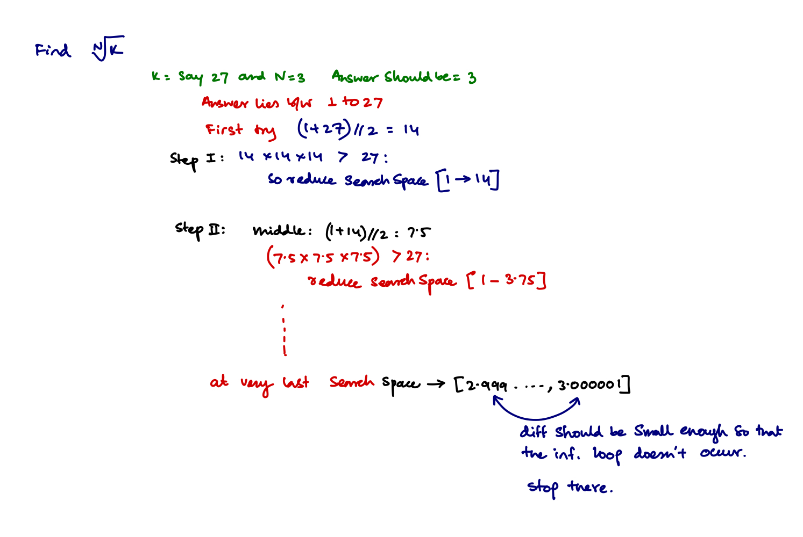

# :material-cloud-search: Binary Search Introductions

Whenever a sorted array is given try to apply the binary search on that. This divides the array into two parts and only works on the other part. Recursion equation $T(n) = T(\frac{N}{2}) + C$

## Toy problem to start
### Problem Statement
Find the ceil of a target number for given set of numbers. That is find the smallest number that is greater or equal to the target number from the given array only.

### Example
```
Given Array: [2, 3, 4, 5, 6, 7, 8, 10]
Target: 7.9
Return: 8

Target: 8.2
Return 10
```

### Approach
- This is exactly the binary search problem but instead of reporting that we don't find the target number, if we don't find the target number, we return the next biggest number.
- If the number is not found it means that the target number is not present, we have to return the next biggest number. Now the while loop will break at `end < start`. So the start pointer will be pointing to the next biggest number.


```python
def ceil(array: list[int], target: int) -> int:
    # Run the actual binary search algorithm and return the element if found

    start: int = 0
    end: int = len(array) - 1

    while start <= end:
        middle: int = int((start + end) / 2)
        if array[middle] < target:
            start = middle+1
        elif array[middle] > target:
            end = middle-1
        else:
            return array[middle]

    # If the element is not found, then the while loop's start and end pointer crosses
    # each other and the start pointer points to the smallest element larger than the
    # target element.
    return array[start]

```

!!! danger "Test Cases"
    1. $[2, 3, 5, 6, 6.6, 6.7, 7, 10]$, $\text{target} = 9$
    2. $[2, 3, 5, 6, 6.6, 6.7, 7, 10]$, $\text{target} = 6.25$
    3. $[2, 3, 5, 6, 6.6, 6.7, 7, 10]$, $\text{target} = 6.7$
    4. $[2, 3, 5, 6, 6.6, 6.7, 7, 10]$, $\text{target} = 6.1$
    5. $[2, 3, 5, 6, 6.6, 6.7, 7, 10]$, $\text{target} = 3.27$
    6. $[2, 3, 5, 6, 6.6, 6.7, 7, 10]$, $\text{target} = 3$


```python
print("Answer is:",ceil([2, 3, 5, 6, 6.6, 6.7, 7, 10], target=9), "Actual should be 10")
print("Answer is:",ceil([2, 3, 5, 6, 6.6, 6.7, 7, 10], target=6.25), "Actual should be 6.6")
print("Answer is:",ceil([2, 3, 5, 6, 6.6, 6.7, 7, 10], target=6.7), "Actual should be 6.7")
print("Answer is:",ceil([2, 3, 5, 6, 6.6, 6.7, 7, 10], target=6.1), "Actual should be 6.6")
print("Answer is:",ceil([2, 3, 5, 6, 6.6, 6.7, 7, 10], target=3.27), "Actual should be 5")
print("Answer is:",ceil([2, 3, 5, 6, 6.6, 6.7, 7, 10], target=3), "Actual should be 3")
```
```
Answer is: 10 Actual should be 10
Answer is: 6.6 Actual should be 6.6
Answer is: 6.7 Actual should be 6.7
Answer is: 6.6 Actual should be 6.6
Answer is: 5 Actual should be 5
Answer is: 3 Actual should be 3
```

## Find out the Nth Root of a given element.
### Problem Statement
For a given N and a number K, find $\sqrt[N]{K}$.
### Approach
- It is obvious that the root of the number should lie between $\{1, 2, ..., K\}$.
- Now take the avg and reduce the search space to $\{1, 2, ..., \frac{K}{2}\}$ or $\{\frac{K}{2}, ..., K\}$.
- Repeat until the difference between higher bound and lower bound is less than some $\epsilon = 10^{-6}$





```python
from typing import Union
THRESHOLD = 1e-6

def get_N_power(value: int, root: int):
    answer: int = 1
    while root > 0:
        answer *= value
        root -= 1
    return answer


def find_n_th_root(number: int, root: int) -> Union[int, float]:
    
    # The nth root lies between the 1, and the number
    start: int = 1
    end: int = number
    
    while (end - start) > THRESHOLD:
        middle: float = (start + end) / 2.0
        if get_N_power(middle, root) > number:
            end = middle
        elif get_N_power(middle, root) < number:
            start = middle
        else:
            return middle

    return start, end
```

```python
find_n_th_root(1024, 2)    # ->  (31.999999971129, 32.000000923871994)
```

```python
import math
math.sqrt(1024) # Successfully verified -> 32.0
```

```python
# Some more test cases
print("Our Function call returns in range:", find_n_th_root(1024, 2), "Original Values", math.sqrt(1024))
print("Our Function call returns in range:", find_n_th_root(256, 4), "Original Values", math.sqrt(math.sqrt(256)))
print("Our Function call returns in range:", find_n_th_root(128, 2), "Original Values", math.sqrt(128))
print("Our Function call returns in range:", find_n_th_root(3, 2), "Original Values", math.sqrt(3))
print("Our Function call returns in range:", find_n_th_root(81, 3))
```
```
Our Function call returns in range: (31.999999971129, 32.000000923871994) Original Values 32.0
Our Function call returns in range: (3.9999998211860657, 4.000000771135092) Original Values 4.0
Our Function call returns in range: (11.313708141446114, 11.31370908766985) Original Values 11.313708498984761
Our Function call returns in range: (1.7320499420166016, 1.732050895690918) Original Values 1.7320508075688772
Our Function call returns in range: (4.326748609542847, 4.326749205589294)
```

## Median of Row Wise Sorted Matrix
### Problem Statement
We are given a row-wise sorted matrix of size $r*c$, we need to find the median of the matrix given. It is assumed that $r*c$ is always odd.
### Example
```
Input : 1 3 5
        2 6 9
        3 6 9
Output : Median is 5
If we put all the values in a sorted 
array A[] = 1 2 3 3 5 6 6 9 9)


Input: 1 3 4
       2 5 6
       7 8 9
Output: Median is 5
```

### Constraints
- Each entry in the array is from $1 \to 10^9$
- R and C are always odd.

### Apporach
#### Naive Approach
- Iterate over all the elements, and then sort them,
- then return the middle element.
#### Time Complexity for this naive apporach
- $O(NM)$ for the traversal,
- $O(NM \log MN)$ for Sorting and,
- Constant $O(1)$ time for the middle element. So total of $O(NM \log MN)$.
#### Space Complexity
- $O(NM)$ Extra space is required.

#### More optimized apporach


```python

```
