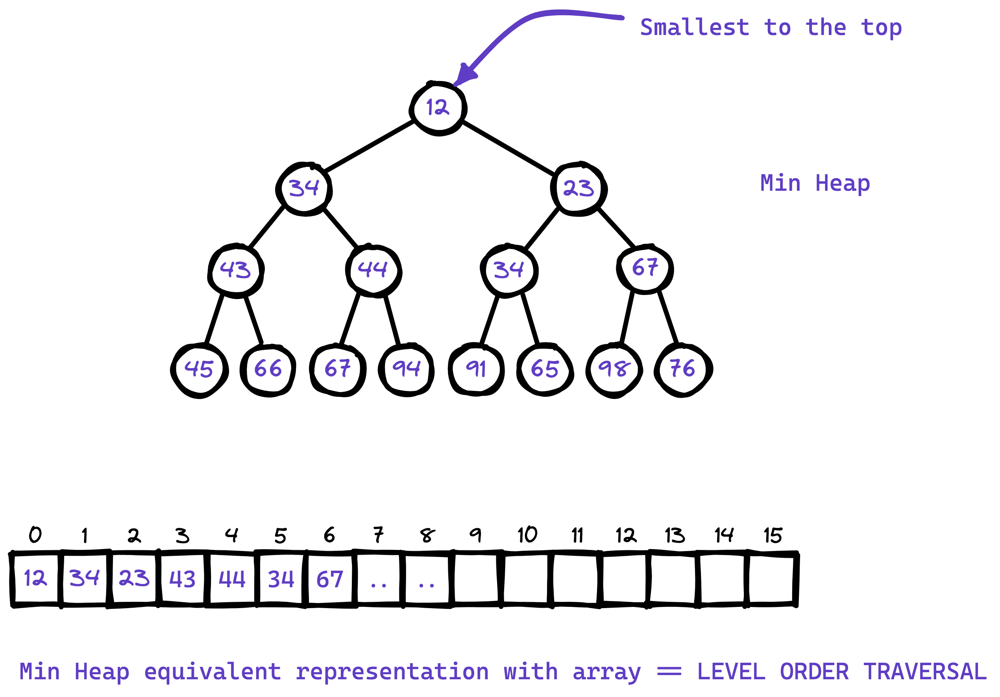
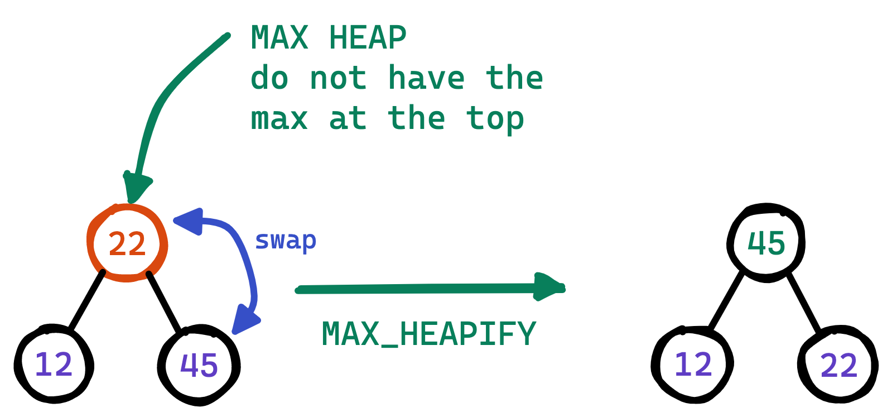

# Priority Queues and Binary Heaps
## What are these priority queues?
A priority queue is a queue where the most important element is always at the front. The queue can be a max-priority queue (largest element first) or a min-priority queue (smallest element first).

So as a data structure designer you have the following options to design a priority queue:

- An max sorted array or min-sorted array, but downside is inserting new items is slow because they must be inserted in sorted order.
- or an binary heap (max heap or min heap)

Now the question arises what are heaps? The heap is a natural data structure for a priority queue. In fact, the two terms are often used as synonyms. A heap is more efficient than a sorted array because a heap only has to be partially sorted. All heap operations are in the order of $\text{log}$ or $O(\mathcal{N})$.

Examples of algorithms that can benefit from a priority queue implemented as heap

* Dijkstra's algorithm for graph searching uses a priority queue to calculate the minimum cost.
* A* pathfinding for artificial intelligence.
* Huffman coding for data compression. This algorithm builds up a compression tree. It repeatedly needs to find the two nodes with the smallest frequencies that do not have a parent node yet.
* Heap sorting algorithm.

## Identification

You should make and use heap for the problems with the following combination:

- K &
- largest or smallest,
- and solvable by sorting the input seq.

## `STL` Usage
A priority queue is a container adaptor that provides constant time lookup of the largest (by default) element, at the expense of logarithmic insertion and extraction. The default container is a `std::vector<T>` underneath.

A user-provided Compare can be supplied to change the ordering, e.g. using `std::greater<T>` would cause the smallest element to appear as the `top()` [Min Heap].


### Functions to remember
- `top()` to get the top of the heap. [either min or max element at the time]
- `empty()` returns false if the heap is not empty,
- `size()` number of elements in the heap,
- `push()` to add element takes $O(\log N)$ comparisons and then the time for `push_back()` method for the underlying container. By default the `std::vector<T>` container is used,
- `pop()` to remove the top element and build heap. $O(\log N)$ comparisons and then the time for `push_back()` method for underlying container.

## Recommended use of heaps instead of using `STL`
Most likely the input to the problem involving heap is a sequence of numbers given in a `std::vector<int>`. Now it'll be very rewarding if you use the corman textbook guideline to heapify the vector in-place in $O(N)$ time.

I've implemented the following functions for heap usage according to the Corman textbook. You understand these following implementation very well and you should be able to implement them in an interview setting under couple of minutes.

Must watch to follow the following code

<iframe width="560" height="315" src="https://www.youtube.com/embed/Xnpo1atN-Iw" title="YouTube video player" frameborder="0" allow="accelerometer; autoplay; clipboard-write; encrypted-media; gyroscope; picture-in-picture" allowfullscreen></iframe>

### Things to look out before you start
- First we are implicitly thinking the almost/nearly complete binary tree for heap but actually using a `std::vector<int>` to represent in memory.
	
	

- In this representation we do not need to store the pointers to the elements for `left` or `right`. Instead use the following functions
	```cpp
	int left(int index){
		// Assuming 0 based index
		return index * 2 + 1;
	}

	int right(int index){
		return index * 2 + 2;
	}
	```

- Similarly to get the parent element we just have to write the inverse of the upper two functions
	```cpp
	int parent(int childIndex){
		// Return floor (index / 2)
		return index / 2; // integer division returns floor
	}
	```

Now that we know how the heap is structured we are ready to implement 3 helper functions.

!!! danger "Why are we doing this instead of `std::priority_queue<int>`?"
	If you have the sequence before you start the function, inserting elements into a new `std::priority_queue<int>` will take $O(N) * \text{one element insertion time} = O(N \log N)$ time. With that you are required to use additional space as well. If you use the following approach you will get constant memory heap build in $O(N)$ time, although you'll lose access to the original ordering of elements in the vector.

	So according to the problem you should be able to switch between these 2 different approaches to build the heap. However it is recommended to use the following approach it takes $O(N)$ time.

### Heap Build Subroutines
There are 2 subroutines according to the the guidelines described in Corman Book. In the following implementation I'll be building a Max Heap, change the code accordingly for min heap implementation.

- In order to maintain the heap property we call subroutine $\text{MAX_HEAPIFY(A, i)}$, cures the heap of one-place violation only. The element at this location might have to go down to the very last level of the heap. So the time complexity for this algorithm is $O(h)$ where $h$ is the height of the heap. The following example shows how one place violation of the heap property can be?
	
- Now we can use this $\text{MAX_HEAPIFY(A, i)}$ in a bottom up manner to convert an unordered array $A[0... n]$ into a max heap.


### C++ Code
```cpp
void maxHeapify(std::vector<int> *vector, int atIndex){
	// Interface: MaxHeapify of `std::vector` vector, and the violation is at `atIndex`
	// Only solves a single violation
	
	int leftChildren = atIndex*2 + 1;
	int rightChildren = atIndex*2 + 2;

	int largest;

	// Now check of the elements is present in the heap?
	if ((leftChildren <= vector->size()) && ((*vector)[leftChildren] > (*vector)[atIndex])){
		largest = leftChildren;
		
	} else if ((rightChildren <= vector->size()) && ((*vector)[rightChildren] > (*vector)[atIndex])){
		largest = rightChildren;
	} else {
		largest = atIndex;
	}

	if (largest != atIndex){
		std::swap((*vector)[atIndex], (*vector)[largest]);
		maxHeapify(vector, largest);
	}
}


void buildHeap(std::vector<int> *vector){
	// Build heap procedure. Runs in O(N) time in-place.
}
```