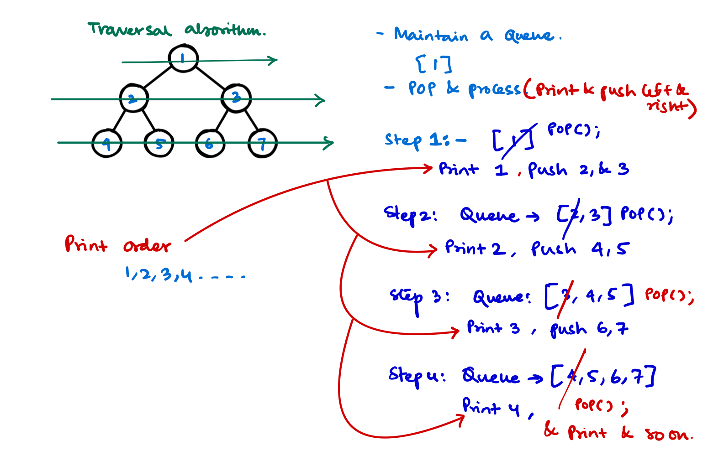
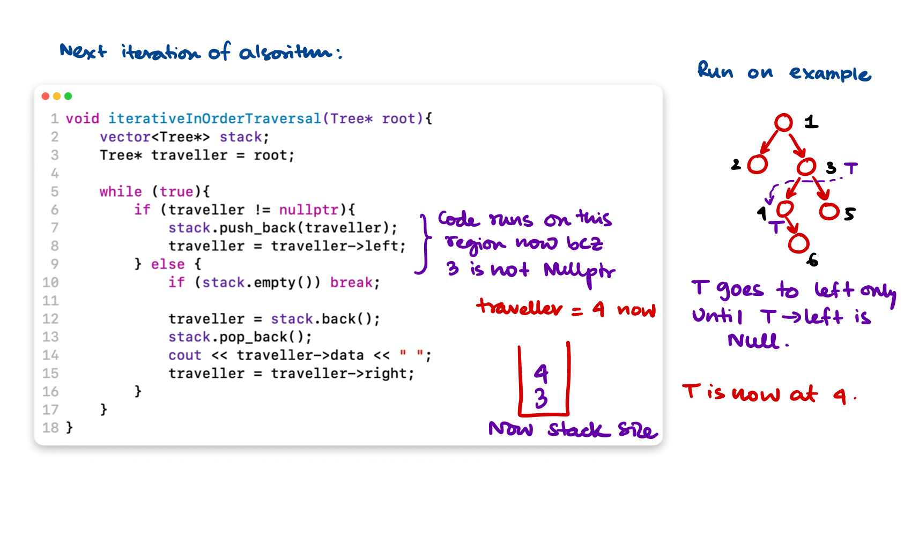
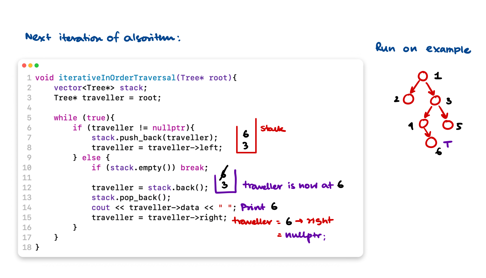
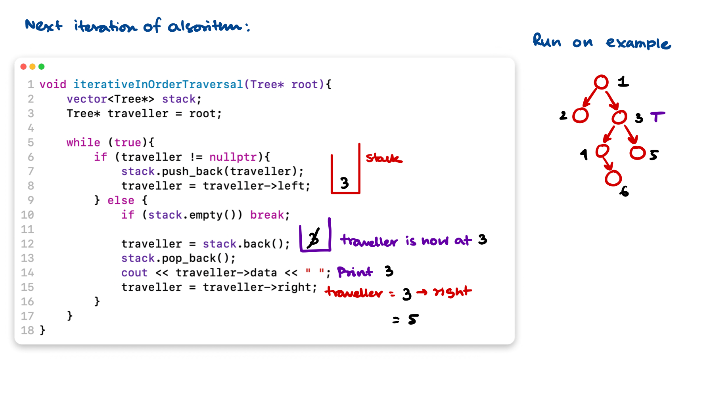

# :material-graph: Tree Problems

## Traversal problems
### Inorder, preorder, and postorder traversal
Let's don't waste time and finish the "confusing" topic of pre order, post order and in order traversal on binary trees. Most of my friends tell me that they often forget how each traversal works and ask me how to remember them. Well, here you go

When running through a tree (binary or binary search tree) we start from the root. Now arrange the queue of nodes like this if we visit

1. the node for the first time we add that to the pre-order queue,
2. the node for the second time we add that to the in-order queue,
3. the node for the 3rd time we add that to the post-order queue.

And now you have 3 queues each with pre-in-post order traversal path.

Also make a note that if the binary tree is a binary search tree, then the in-order traversal will give a sorted array. We can use this property to check if the binary tree is a binary search tree or not.

### More formal definition
1. Pre order traversal is implemented like this: $\text{Root} \to \text{Left} \to \text{Right}$
2. In-order traversal is implemented like this: $\text{Left} \to \text{Root} \to \text{Right}$
3. In-order traversal is implemented like this: $\text{Left} \to \text{Right} \to \text{Root}$

### C++ Code
```cpp
// Definition of the tree node
struct TreeNode {
    int data;
    TreeNode *left;
    TreeNode *right;

    TreeNode(int value) {
        data  = value;
        left  = nullptr;
        right = nullptr;
    }
};


void inOrderTraversal(TreeNode *nodePointer){

    if (nodePointer != nullptr) {
        inOrderTraversal(nodePointer->left);
        printf("%d ", nodePointer->data);
        inOrderTraversal(nodePointer->right);
    }
}

void preOrderTraversal(TreeNode *nodePointer){

    if (nodePointer != nullptr) {
        printf("%d ", nodePointer->data);
        preOrderTraversal(nodePointer->left);
        preOrderTraversal(nodePointer->right);
    }
}

void postOrderTraversal(TreeNode *nodePointer){

    if (nodePointer != nullptr) {
        postOrderTraversal(nodePointer->left);
        postOrderTraversal(nodePointer->right);

        printf("%d ", nodePointer->data);
    }
}
```

### Level order traversal for binary trees

For the following binary tree

```mermaid
graph TB
    12((12)) --> 44((44)) & 112((112))
    112      --> aa((34)) & bb((55))
    44       --> aaa((69)) & bbb((420))
```

The equivalent level order traversal should be

```mermaid
graph LR  
    a[12] --> b[44] --> c[112] --> 34 --> 55 --> 69 --> 420
```
#### Approach
- If you see there is a queuing order, every level of the tree gets processed from left to right.
- Then in the next level they are processed from left to right as well as their parent's order.
- So if we use a queue we can solve this problem.
    
- With queue we can solve this problem, and here is a step by step approach
    

## Balanced Binary Tree
[Problem on leetcode $\to$](https://leetcode.com/problems/balanced-binary-tree/)
### Problem Statement
Given a binary tree, determine if it is height-balanced.

### Approach
- If a binary tree is height-balanced then the difference of height of the right subtree and left subtree should not be greater than 2.
- Now from the last problem we can recursivly find the height of the left and right subtrees and check if the difference between them is > 1.
- If at any point we find that the height difference is > 1, we indicate this some how to the main function and say it's not height balanced.

### Code
```cpp
class Solution {
public:
    int height(TreeNode *root) {
        if (!root) return 0;
        
        // recursively find the height of subtrees
        int leftheight = height(root->left);
        int rightheight = height(root->right);
        
        // if we find a height imbalance we inform it to the parent.
        if (std::abs(leftheight - rightheight) > 1) return -1;

        // If [at parent] we find one of the subtrees has height imbalance
        // we return -1 and exit the program
        if (leftheight == -1 or rightheight == -1) return -1;
        
        return 1 + max(leftheight, rightheight);
    }
    
    bool isBalanced(TreeNode* root) {
        // if the subroutine finds anywhere in the tree a height imbalance
        // we return false.
        return height(root) != -1;
    }
};
```

## Branch Sum Problem
### Problem Statement
You'll be given the root node of the binary tree. Now you have to return all the branch's "SUM" in a vector.
### Example:

### Approach
The code should be almost similar to the height finding recursive approach for binary trees. Here we will change the code slightly so that we pass a `int sum` with each recursion and continue to add until we reach the bottom of the tree. 

At leaf node we check if `(tree->left == nullptr and tree->right == nullptr)` then we just push the sum to the answer and return.

### Code
```cpp
void branchSum(vector<int> &v, Tree* tree, int sum) {
    if (tree->left == nullptr and tree->right == nullptr) {
        v.push_back(sum + tree->data);
        return;
    }

    branchSum(v, tree->left, sum+tree->data);
    branchSum(v, tree->right, sum+tree->data);
}

int main(){
    vector<int> v;
    branchSum(v, root, 0);

    for (auto t:v)
        cout << t << " ";
}
```

**Output**
```
INORDER TRAVERSAL OF THE TREE
4 2 5 1 6 3 7 
Branch Sum of TREE
7 8 10 11 
```

## Invert a binary tree
### Problem statement
You'll be given a binary tree, find out the inverted equivalent of the tree. It is prefered to do the inversion in place.

**Example**

Let's say we have a binary tree B. Inverting the binary tree will result into the mirror immage of the tree.


### Apporach

- This is probably one of the best tree questions, it seems that there are a lot of things to track here. So solving this problem requires attention to lot of details.
- The apporach to solve this is to swap the nodes instead of the values.
- First we swap the left node with the right node for the head and then recursively swap the left and right nodes for the left and right nodes.

```cpp
/**
 * Definition for a binary tree node.
 * struct TreeNode {
 *     int val;
 *     TreeNode *left;
 *     TreeNode *right;
 *     TreeNode() : val(0), left(nullptr), right(nullptr) {}
 *     TreeNode(int x) : val(x), left(nullptr), right(nullptr) {}
 *     TreeNode(int x, TreeNode *left, TreeNode *right) : val(x), left(left), right(right) {}
 * };
 */
class Solution {
public:
    TreeNode* invertTree(TreeNode* root) {
        if (root){
            TreeNode* temp = root->left;
            root->left = root->right;
            root->right = temp;
        
            invertTree(root->left);
            invertTree(root->right);
        }
        
        return root;
    }
};
```

### Approach With BFS
I personally don't prefer any recursive approach. With BFS also we can easily solve this problem. We put the node in queue to be processed and when we are at this node if this is not `NULL` we swap it's left and right children.

This is the way we can swap left and right thus inverting it level by level because BFS works level order.
```cpp
class Solution {
public:
    TreeNode* invertTree(TreeNode* root) {
        queue<TreeNode*> q;
        q.push(root);
        
        while(!q.empty()){
            
            TreeNode* thisNode = q.front();   // get front of the queue to process
            q.pop();
            
            
            if (thisNode != nullptr){
                // swap it's left and right
                TreeNode* left = thisNode->left;
                thisNode->left = thisNode->right;
                thisNode->right = left;
                
                q.push(thisNode->left);  // put both the children to be processed later
                q.push(thisNode->right);
            }
        }
        
        return root;
    }
};
```

## Iterative In Order Traversal
As you probably guessed, I don't like to use recursive approaches all that much. In tree traversals you have to iterate over the tree in the following order: $\text{Left} \to \text{Right} \to \text{Root}$.

**Now how can we avoid recursion?** One possible solution could be to use stack and imitate the call stack.

### Code
We should mimic the behavior of the recursion in the recursive implementation of the in order traversal.
```cpp
void iterativeInOrderTraversal(Tree* root){
    vector<Tree*> stack;
    Tree* traveller = root;

    while (true){
        if (traveller != nullptr){
            stack.push_back(traveller);
            traveller = traveller->left;
        } else {
            if (stack.empty()) break;

            traveller = stack.back();
            stack.pop_back();
            cout << traveller->data << " ";
            traveller = traveller->right;
        }
    }
}
```

Now that we've seen the code, we should analyse the code using a dry run.

**This is the starting of the algorithm**. In first step we go left until the first `NULL` is found, and we put all the nodes into the stack so to process later.


**Now** at this point we've reached the point where we should start processing the node. This node `stack.top()` do not have any left children so for left we don't do anything, and print this node, then we should go to right and process that.


**We keep on deleting from stack and print until we go right** of Node 1.


**Now we** reached to a `non-NULL` node so the `if` part will be executed. It will put all the left of `3` into the stack until a `NULL` is reached. 






At the very last step $\text{NODE}(5)$ will be processed which I did not show. It's a genuinely good problem and there is a lot to keep track of in the iterative version for a easy recursive problem. 

This goes to show how much the recursion stack actually helps, but at the cost of proper mental gymnastics to come up with a recursive approach.

## Minimum Depth of a Binary Tree
[Find the Problem on Leetcode $\to$](https://leetcode.com/problems/minimum-depth-of-binary-tree/)
### Problem statement
Find the minimum depth of a binary tree. The minimum depth is the number of nodes along the shortest path from the root node to the nearest leaf node.
### Examples:
Depth = Path of 1 $\to$ 3. So the code should return 2.
```mermaid
graph TD
    1((1)) --> 2((2)) & 3((3))
    2      --> 4((4)) & 5((5))
    style 1 fill:#bbf, color:#fff
    style 3 fill:#bbf, color:#fff
```

Depth = Path of 12 $\to$ 7 $\to$ 9. So the code should return 3.

```mermaid
graph TD
    12((12)) --> 7((7)) & 1((1))
    7 --> 9((9))
    1      --> 10((10)) & 5((5))
    10 --> 11((11))
    style 12 fill:#bbf, color:white
    style 7 fill:#bbf, color:#ffffff
    style 9 fill:#bbf, color:#ffffff
```
### Approach
- This is a pattern related to breath first search traversal.
- Think of this logically, if you traverse level by level and you find the first node that is a leaf node. This means you found the shallowest node in the binary tree.
- You track and return the depth of that shallowest node.
### C++ Code
```cpp
/**
 * Definition for a binary tree node.
 * struct TreeNode {
 *     int val;
 *     TreeNode *left;
 *     TreeNode *right;
 *     TreeNode() : val(0), left(nullptr), right(nullptr) {}
 *     TreeNode(int x) : val(x), left(nullptr), right(nullptr) {}
 *     TreeNode(int x, TreeNode *left, TreeNode *right) : val(x), left(left), right(right) {}
 * };
 */
class Solution {
public:
    int minDepth(TreeNode* root) {
        
        if (!root) return 0;
        
        queue<pair<TreeNode*, int>> q;
        
        int depth = 1;
        
        q.push({root, 1});
        
        while(!q.empty()){
            TreeNode* front = q.front().first;
            int nextDepth = q.front().second + 1;
            
            q.pop();
            
            if (front->left) q.push({front->left, nextDepth});
            if (front->right) q.push({front->right, nextDepth});
            if (!front->left and !front->right) return nextDepth - 1;
            
            depth = nextDepth;
        }
        
        return depth;
    }
};
```

## Connect Level Order Siblings

[Find the Problem on Leetcode $\to$](https://leetcode.com/problems/populating-next-right-pointers-in-each-node/)

### Problem statement
Given a binary tree, connect each node with its level order successor. The last node of each level should point to a null node in place.

A **new** `next` attribute is added to the tree structure. Update the `next` in-place.
### Example


### Approach With Extra Space
- We store level wise node references in a `vector<vector<Node *>>` using BFS and a modified queue,
- then we link them together. To maintain the `vector<vector<Node *>>` we need $O(N)$ Space.

#### Code for this approach
```cpp
/*
// Definition for a Node.
class Node {
public:
    int val;
    Node* left;
    Node* right;
    Node* next;

    Node() : val(0), left(NULL), right(NULL), next(NULL) {}

    Node(int _val) : val(_val), left(NULL), right(NULL), next(NULL) {}

    Node(int _val, Node* _left, Node* _right, Node* _next)
        : val(_val), left(_left), right(_right), next(_next) {}
};
*/

class Solution {
public:
    Node* connect(Node* root) {
        
        if (!root) return root;
        
        queue<pair<Node*, int>> q;
        vector<vector<Node*>> v;
        
        int depth = 1;
        q.push({root, depth});
        
        while(!q.empty()) {
            Node* front = q.front().first;
            int depth = q.front().second;
            
            q.pop();
            
            if (depth > v.size()) {
                vector<Node*> v1;
                v1.push_back(front);
                v.push_back(v1);
            } else if (depth == v.size()) {
                v[depth - 1].push_back(front);
            }
            
            if (front->left) q.push({front->left, depth + 1});
            if (front->right) q.push({front->right, depth + 1});
            
        }

        // for each level of nodes process the next attribute and set to its neighbors.
        
        for (auto level:v) {
            int size = level.size();
            int index = 0;
            
            while(index < size - 1){
                level[index] -> next = level[index + 1];
                index++;
            }
            
            level[index]->next = nullptr;
        }
        
        return root;
    }
};
```

### Approach with a bit less space

[Question on Leetcode $\to$](https://leetcode.com/problems/path-sum)

In this approach, instead of storing the level wise ordering in a vector of vectors, we simply link the nodes as we go by just keeping one reference to the previously processed node. But still we have to keep the queue in order to run the BFS. So the extra space is actually needed which is $\text{MAX(WIDTH of TREE)}$.

## Binary Tree Path Sum
### Problem Statement
Given a binary tree and a number ‘S’, find if the tree has a path from root-to-leaf such that the sum of all the node values of that path equals ‘S’.

### Example
1. **Path Sum** = $28$. **Output** = TRUE.
2. **Path Sum** = $21$. **Output** = False. No path in the following tree has sum 21.
```mermaid
graph TD
    12((12)) --> 7((7)) & 1((1))
    7 --> 9((9))
    1      --> 10((10)) & 5((5))
    10 --> 11((11))
    style 12 fill:#bbf, color:white
    style 7 fill:#bbf, color:#ffffff
    style 9 fill:#bbf, color:#ffffff
```
### Code approach 1
- We recursively go in depth first search and check if the sum is matching with the path,
- if yes we return `true`.


```cpp
class Solution {
public:
    bool hasPathSum(TreeNode* root, int targetSum) {
        
        if (!root) return false;
               
        if (!root->left and !root->right) {
            if (targetSum == root->val) {
                return true;
            }
        }
        
        return hasPathSum(root->left, targetSum - root-> val) || hasPathSum(root->right, targetSum - root-> val);
    }
};
```

### Code approach 2
It has a separate private boolean variable `a` which can even be modified to store how many times a path sum target is met.
```cpp
class Solution {
private:
    bool a[2] = {false, false};
public:
    bool hasPathSum(TreeNode* root, int targetSum) {
        if (!root) return false;
        
        if (not root->left and not root->right) {
            if (root->val == targetSum) {
                a[0] = true;
                a[1] = true; // sets if at least 1 true occurred
            } else {
                a[0] = false; // resets to false if some branch did not cut it
            }
        }
        
        hasPathSum(root->left, targetSum-root->val);
        hasPathSum(root->right, targetSum-root->val);
        
        return a[0] || a[1];
    }
};
```

## Count All Paths for a Sum
In the previous example we checked if some path contains the sum or not? but here find all paths from root-to-leaf such that the sum of all the node values of each path equals ‘S’. Return the count of paths matching the sum.

### Approach
Approach is the same as the previous approach's code #$2$, with a little modification. Instead of marking true if some path gives a match we'll update some counter.
### Code
```cpp
class Solution {
private:
    pair<bool, int> a = {false, 0}; // instead we put a counter in there.
public:
    int countPathSum(TreeNode* root, int targetSum) {
        if (!root) return false;
        
        if (not root->left and not root->right) {
            if (root->val == targetSum) {
                a.first = true;
                a.second += 1; // updates per target sum occurrences.
            } else {
                a.first = false; // resets to false if some branch did not cut it
            }
        }
        
        countPathSum(root->left, targetSum-root->val);
        countPathSum(root->right, targetSum-root->val);
        
        return a.second;
    }
};
```

## Traceout All Paths for a Sum
It is the same as the previous problem but here you have to return the path where the sum is matching. Return a `vector<vector<Tree*>>`. Given the root of a binary tree and an integer targetSum, return all root-to-leaf paths where the sum of the node values in the path equals targetSum. Each path should be returned as a list of the node values, not node references.

A root-to-leaf path is a path starting from the root and ending at any leaf node. A leaf is a node with no children.

[**Same Problem on Leetcode** $\to$](https://leetcode.com/problems/path-sum-ii/)

### Example
Target sum for the following tree: $34$
```mermaid
graph TD
    12((12)) --> 7((1)) & 1((1))
    7 --> 9((21))
    1      --> 10((10)) & 5((5))
    10 --> 11((11))
    style 12 fill:#bbf
    style 7 fill:#bbf
    style 10 fill:#bbf
    style 9 fill:#bbf
    style 11 fill:#bbf
    style 1 fill:#bbf
```

Paths that returns $34$ are the following:

- $12 \to 1 \to 21$
- $12 \to 1 \to 10 \to 11$

So these 2 path should be returned as the function finishes.

### Approach
- We create 2 vectors: one `vector<vector<Tree*>>` and one `vector<Tree*>`, the second one `vector<Tree*>` will be unique for each recursion level,
- When we traverse the tree Depth First we put the nodes into `vector<Tree*>`,
- When we reach the leaf node we check if the sum is matchting with the desired path sum. If yes we record the path sum.


### Code
```cpp
/**
 * Definition for a binary tree node.
 * struct TreeNode {
 *     int val;
 *     TreeNode *left;
 *     TreeNode *right;
 *     TreeNode() : val(0), left(nullptr), right(nullptr) {}
 *     TreeNode(int x) : val(x), left(nullptr), right(nullptr) {}
 *     TreeNode(int x, TreeNode *left, TreeNode *right) : val(x), left(left), right(right) {}
 * };
 */
class Solution {
public:
    vector<vector<int>> pathSum(TreeNode* root, int targetSum) {
        vector<int> thisLevel;
        vector<vector<int>> answer;
        
        // recursively go dfs
        helper(root, targetSum, thisLevel, answer);
        
        return answer;
    }
    
    void helper(TreeNode* root, int targetSum, vector<int> thisLevel, vector<vector<int>> &answer){
        if (!root) return;
        
        thisLevel.push_back(root->val);
        
        if (not root->left and not root->right) {
            if (targetSum == root->val) {
                // means this path sum is exactly the targetSum
                // record the path
                answer.push_back(thisLevel);
            }
        }
        
        helper(root->left, targetSum - root->val, thisLevel, answer);
        helper(root->right, targetSum - root->val, thisLevel, answer);
    }
};
```